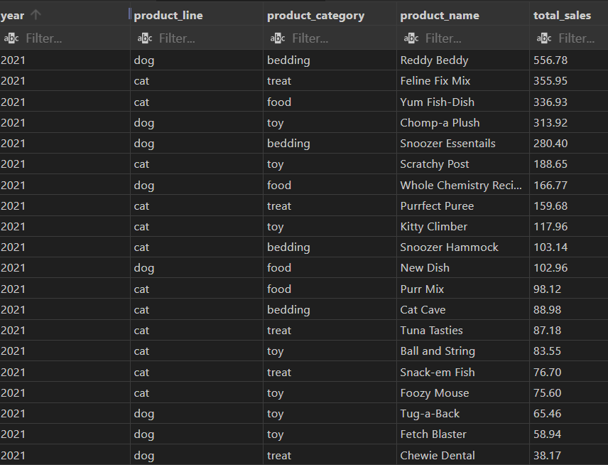
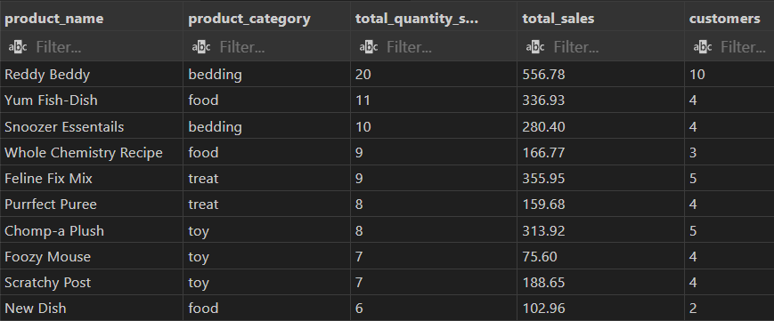
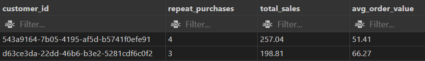
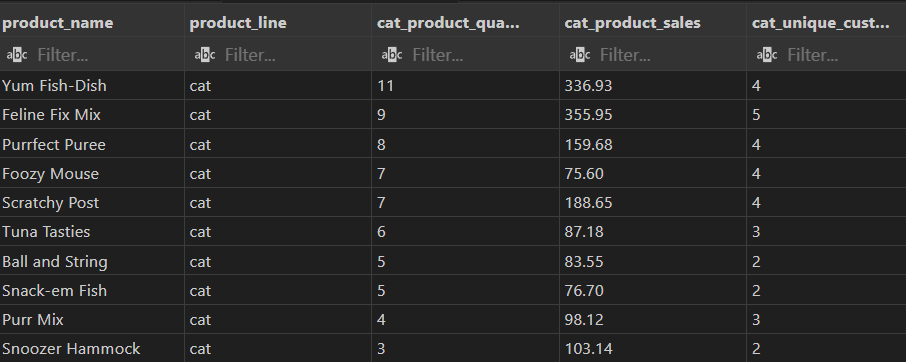
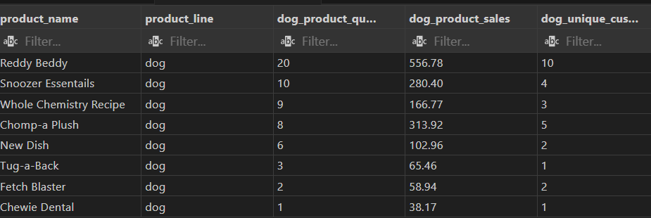
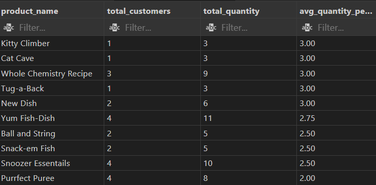

# Introduction
Let me introduce you to Inu+Neko, a dog and cat care company. Focusing on the company's sales data, this project investigates the sales of products over the past year, the most popular products, products purchased on a regular basis, and regular customers.

SQL queries? Check them out here: [project_inu_neko folder](/project_inu_neko/)

# Background
Inu+Neko is a company that sells organic dog and cat food, pet toys, and grooming services. Carlos, the owner of Inu+Neko, is looking to expand his customer base. Carlos has an idea for a new product that he wants to launch - a food subscription for cats and dogs. He realizes that many of his customers come back regularly, so he believes that a subscription can add some convenience to their lives. It's a good way for Carlos to keep his customers loyal. He wants to have 500 subscribers next year. Carlos wants to make sure he is providing the best product possible. He asked analyst Kira a question: What 10 products should be offered as part of the subscription? Carlos can't offer all of his products because it would be challenging for him to keep all of the products in stock from the start of the product launch. Therefore, he suggests choosing 5 products for cats and 5 products for dogs. Based on Carlos's question, analyst Kira defined the goal of the analysis: to select the products that should be offered in the subscription to get 500 subscribers in the first year. 

For the analysis, the dataset [Inu_Neko_Sales.csv](Inu_Neko_Sales.csv) from Carlos about the sales of products sold by Inu+Neko was received. 

### The questions that the analyst Kira wanted to answer with her SQL queries were as follows:

1. What were the sales of goods over the past year?
2. What were the most popular products over the past year?
3. Who are the regular customers?
4. Analysis of products for cats.
5. Analysis of products for dogs.
6. Which products have the highest repeat purchase rate?

# Tools used for analysis
Kira used a few key tools to take a deep dive into Inu+Neko's sales:

- **Google Sheets:** The tool of choice for research and data cleaning. 
- **SQL:** The basis of Kira's analysis, allowing her to query the database and find important data.
- **PostgreSQL:** The database management system of choice, ideal for processing sales data.
- **Visual Studio Code:** The main tool for managing databases and executing SQL queries.
- **Git and GitHub:** Required for version control and sharing SQL scripts and analysis, enabling collaboration, and project tracking.
- **Tableau:** Building visualizations for more visual answers to the questions of the company owner.

# The Analysis
At the beginning of the analysis, the Inu_Neko_Sales.csv dataset contained 11 columns and 301 rows. When Kira examined the data, she found a lot of missing values in the Size column - the size of the package did not carry important information, so she removed it. Several records did not have a Customer_id value - it was not known whether this customer returned regularly or one-time. For analysis purposes, records without Customer_id are not valuable, so she deleted 12 rows. Kira also discovered that some product names were missing, but there was a SKU (unique product identifier) value next to them that could be used to determine the product name and fill in the missing values. Next, she found that some Product_Category values (bedding, food, toy, treat) were missing. But by the name of the products, she determined which category they belong to and filled in the missing values. She also identified one missing Product_Line value by the product name. Now the dataset is clean and ready for analysis, with 10 columns and 289 rows.

Each inquiry for this project was intended to explore certain aspects of the company's sales. Here's how Kira approached each question:

### 1. What were the sales of goods over the past year?
To determine the product sales, she filtered the sales by year, product line, category, product name, and summarized the values, focusing on 2021. This query highlights the highest product sales amounts for 2021.

```sql
SELECT 
    EXTRACT(YEAR from date) as year,
    product_line,
    product_category,
    product_name,
    sum(sales) as total_sales
FROM inu_neko_sales
WHERE EXTRACT(YEAR from date) = 2021
group by year, product_line, product_category, product_name
ORDER BY year DESC, total_sales DESC
;
```


Here's a breakdown of sales by product in 2021:
- **Overall sales:** The company's 20 product names generated revenues ranging from $38.17 to $556.78, indicating varying demand for the products.
- **Product diversity:** Products such as Reddy Beddy, Feline Fix Mix, Yum Fish-Dish, and Chomp-a Plush generated the most revenue for the company, demonstrating the highest demand.
- **Product category diversity:** There are four product categories: Bedding, Treat, Foot and Toy.
- **Product lines:** The products are divided into two lines for cats and dogs.


*A histogram visualizing sales by product in 2021, created using Tableau*. 

### 2. What were the most popular products over the past year?

```sql
SELECT 
    product_name, 
    product_category,
    SUM(quantity) as total_quantity_sold,
    SUM(sales) as total_sales,
    COUNT(DISTINCT customer_id) as customers
FROM inu_neko_sales
WHERE EXTRACT(YEAR from date) = 2021
GROUP BY product_name, product_category
ORDER BY total_quantity_sold DESC
LIMIT 10
;
```


### 3. Who are the regular customers?

```sql
SELECT 
    customer_id,
    COUNT(DISTINCT order_number) as repeat_purchases,
    SUM(sales) as total_sales,
    ROUND(AVG(sales), 2) as avg_order_value
FROM inu_neko_sales
--WHERE EXTRACT(YEAR from date) = 2021
GROUP BY customer_id
HAVING COUNT(DISTINCT order_number) >= 3
ORDER BY COUNT(DISTINCT order_number) DESC
LIMIT 100
;
```


### 4. Analysis of products for cats.

```sql
SELECT 
    product_name,
    product_line,
    SUM(quantity) as cat_product_quantity,
    SUM(sales) as cat_product_sales,
    COUNT(DISTINCT customer_id) as cat_unique_customers
FROM inu_neko_sales
WHERE EXTRACT(YEAR from date) = 2021
    AND product_line = 'cat'
GROUP BY product_name, product_line
ORDER BY cat_product_quantity DESC
LIMIT 10
;
```


### 5. Analysis of products for dogs.

```sql
SELECT 
    product_name,
    product_line,
    SUM(quantity) as dog_product_quantity,
    SUM(sales) as dog_product_sales,
    COUNT(DISTINCT customer_id) as dog_unique_customers
FROM inu_neko_sales
WHERE EXTRACT(YEAR from date) = 2021
    AND product_line = 'dog'
GROUP BY product_name, product_line
ORDER BY dog_product_quantity DESC
LIMIT 10
;
```


### 6. Which products have the highest repeat purchase rate?

```sql
SELECT 
    product_name,
    COUNT(DISTINCT customer_id) as total_customers,
    SUM(quantity) as total_quantity,
    ROUND(SUM(quantity) * 1.0 / COUNT(DISTINCT customer_id), 2) as avg_quantity_per_customer
FROM inu_neko_sales
WHERE EXTRACT(YEAR from date) = 2021
GROUP BY product_name
ORDER BY avg_quantity_per_customer DESC
LIMIT 10
;
```



# What I learned


# Conclusions
