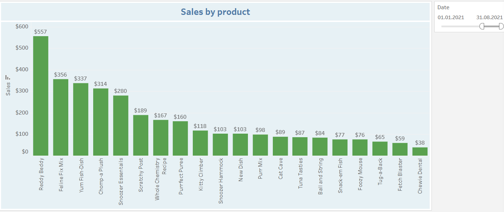
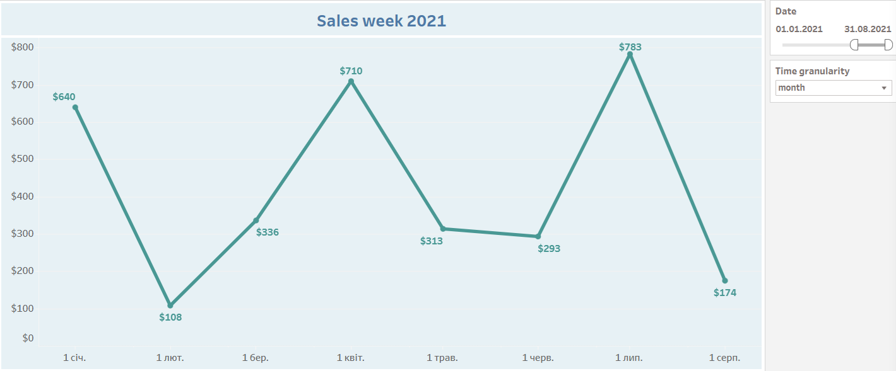
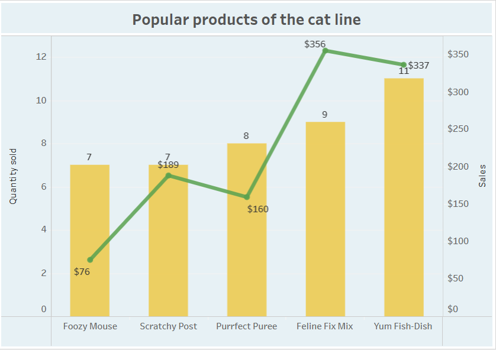

# Introduction
Let me introduce you to Inu+Neko, a dog and cat care company. Focusing on the company's sales data, this project investigates the sales of products over the past year, the most popular products, products purchased on a regular basis, and regular customers.

SQL queries? Check them out here: [project_inu_neko folder](/project_inu_neko/)

# Background
Inu+Neko is a company that sells organic dog and cat food, pet toys, and grooming services. Carlos, the owner of Inu+Neko, is looking to expand his customer base. Carlos has an idea for a new product that he wants to launch - a food subscription for cats and dogs. He realizes that many of his customers come back regularly, so he believes that a subscription can add some convenience to their lives. It's a good way for Carlos to keep his customers loyal. He wants to have 500 subscribers next year. Carlos wants to make sure he is providing the best product possible. He asked analyst Kira a question: What 10 products should be offered as part of the subscription? Carlos can't offer all of his products because it would be challenging for him to keep all of the products in stock from the start of the product launch. Therefore, he suggests choosing 5 products for cats and 5 products for dogs. Based on Carlos's question, analyst Kira defined the goal of the analysis: to select the products that should be offered in the subscription to get 500 subscribers in the first year. 

For the analysis, the dataset [Inu_Neko_Sales.csv](Inu_Neko_Sales.csv) from Carlos about the sales of products sold by Inu+Neko was received. 

### The questions that the analyst Kira wanted to answer with her SQL queries were as follows:

1. What were the sales of goods over the past year?
2. What were the most popular products over the past year?
3. Who are the regular customers?
4. Analysis of products for cats.
5. Analysis of products for dogs.
6. Which products have the highest repeat purchase rate?

# Tools used for analysis
Kira used a few key tools to take a deep dive into Inu+Neko's sales:

- **Google Sheets:** The tool of choice for research and data cleaning. 
- **SQL:** The basis of Kira's analysis, allowing her to query the database and find important data.
- **PostgreSQL:** The database management system of choice, ideal for processing sales data.
- **Visual Studio Code:** The main tool for managing databases and executing SQL queries.
- **Git and GitHub:** Required for version control and sharing SQL scripts and analysis, enabling collaboration, and project tracking.
- **Tableau:** Building visualizations for more visual answers to the questions of the company owner.

# The Analysis
At the beginning of the analysis, the Inu_Neko_Sales.csv dataset contained 11 columns and 301 rows. When Kira examined the data, she found a lot of missing values in the Size column - the size of the package did not carry important information, so she removed it. Several records did not have a Customer_id value - it was not known whether this customer returned regularly or one-time. For analysis purposes, records without Customer_id are not valuable, so she deleted 12 rows. Kira also discovered that some product names were missing, but there was a SKU (unique product identifier) value next to them that could be used to determine the product name and fill in the missing values. Next, she found that some Product_Category values (bedding, food, toy, treat) were missing. But by the name of the products, she determined which category they belong to and filled in the missing values. She also identified one missing Product_Line value by the product name. Now the dataset is clean and ready for analysis, with 10 columns and 289 rows.

Each inquiry for this project was intended to explore certain aspects of the company's sales. Here's how Kira approached each question:

### 1. What were the sales of goods over the past year?
To determine the product sales, she filtered the sales by year, product line, category, product name, and summarized the values, focusing on 2021. This query highlights the highest product sales amounts for 2021.

```sql
SELECT 
    EXTRACT(YEAR from date) as year,
    product_line,
    product_category,
    product_name,
    sum(sales) as total_sales
FROM inu_neko_sales
WHERE EXTRACT(YEAR from date) = 2021
group by year, product_line, product_category, product_name
ORDER BY year DESC, total_sales DESC
;
```


Here's a breakdown of sales by product in 2021:
- **Total sales:** The company's 20 product names generated revenues ranging from $38.17 to $556.78, indicating varying demand for the products.
- **Product diversity:** Products such as Reddy Beddy, Feline Fix Mix, Yum Fish-Dish, and Chomp-a Plush generated the most revenue for the company, demonstrating the highest demand.
- **Product category diversity:** There are four product categories: Bedding, Treat, Foot and Toy.
- **Product lines:** The products are divided into two lines for cats and dogs.



*A histogram visualizing sales by product_name in 2021, created using Tableau. To create a histogram, the analyst used filtering by the Date column, using the Range of dates Filter type.*

 

*This line chart visualizes total weekly sales for 2021, created with Tableau. To create the chart, I used Date filtering, with a Range of dates Filter type. I also added Parameters: Time granularity: week, month, quarter*.


*This line chart visualizes monthly sales for two Product_lines: cat and dog for 2021, created with Tableau. The line chart for the cat line shows the highest sales at the beginning of the year in January and the lowest sales in June. The line chart for dogs shows the highest sales in April and the lowest sales in February. To create the chart, I used Date filtering, and the Filter type was Range of dates. I also added Parameters: Time granularity: week, month, quarter*.

### 2. What were the most popular products over the past year?
To determine the most popular products, I filtered the data by year, found the total number of units sold and the total number of customers who bought it for each product. I sorted them by the number of units sold and then by the number of customers. This query emphasizes the products with the highest number of units sold.
```sql
SELECT 
    product_name, 
    product_category,
    SUM(quantity) as total_quantity_sold,
    SUM(sales) as total_sales,
    COUNT(DISTINCT customer_id) as customers
FROM inu_neko_sales
WHERE EXTRACT(YEAR from date) = 2021
GROUP BY product_name, product_category
ORDER BY total_quantity_sold DESC
LIMIT 10
;
```


Here's a breakdown of the most popular products in 2021:
- **Total quantity sold:** The 10 products that were sold in the largest quantity were in the range of 6 to 10 units.
- **Customers:** The number of customers who bought these products in the range from 2 to 10 people.


*This bar chart visualizes the most popular products for 2021. To create the chart, I used filtering by Date, filter type Range of dates, and filtering by Product_name: 10 products with the highest number of sales*.

### 3. Who are the regular customers?
To identify regular customers, I filtered the data by the number of purchases per customer of 3 or more. I calculated the number of purchases, the total amount spent, and the average check.
```sql
SELECT 
    customer_id,
    COUNT(DISTINCT order_number) as repeat_purchases,
    SUM(sales) as total_sales,
    ROUND(AVG(sales), 2) as avg_order_value
FROM inu_neko_sales
--WHERE EXTRACT(YEAR from date) = 2021
GROUP BY customer_id
HAVING COUNT(DISTINCT order_number) >= 3
ORDER BY COUNT(DISTINCT order_number) DESC
LIMIT 100
;
```


Here are the repeat customers in 2021:
- **Repeat purchases:** There were only 2 repeat customers, based on the fact that they made 3 or more purchases. Other customers made only 1 or 2 purchases.
- **Average order value:** The amount of the average purchase receipt of repeat customers.


### 4. Analysis of products for cats.
To identify cat food products, I filtered the data by year and product line, calculated the number of units sold, the revenue generated, and the number of customers who bought the product. This query highlights the most popular products from the cat line.
```sql
SELECT 
    product_name,
    product_line,
    SUM(quantity) as cat_product_quantity,
    SUM(sales) as cat_product_sales,
    COUNT(DISTINCT customer_id) as cat_unique_customers
FROM inu_neko_sales
WHERE EXTRACT(YEAR from date) = 2021
    AND product_line = 'cat'
GROUP BY product_name, product_line
ORDER BY cat_product_quantity DESC
LIMIT 10
;
```


Here is the analysis of the products from the cat line in 2021:
- **Cat Product Quantity:** The number of units of cat products sold. Yum Fish-Dish has sold the most units.
- **Cat Product Sales:** The amount received from the sale of each product.
- **Cat Unique Customers:** The number of customers who bought each product.




*The bar chart visualizes the most popular products from the cat line in 2021. The line chart visualizes sales for these products. To create the chart, we used filtering by Date, the Filter type was Range of dates, filtering by Product_line: cat, and filtering by Quantity, which ranges from 7 to 11*.


*The pie chart visualizes the top 5 products from the cat line, which had the highest sales in 2021 in the yellow-brown palette and other less profitable products in gray. Each sector of the pie chart shows the percentage share of each product in the cat line of total sales in 2021. To create the chart, we used filtering by Date, the Filter type was Range of dates, filtering by Product_line: cat, and filtering by Product_name: Top 5 products by sales*.

### 5. Analysis of products for dogs.
To identify dog products, she filtered the data by year and product line, calculated the number of units sold, the revenue generated, and the number of customers who bought the product. This query highlights the most popular products from the dog line.
```sql
SELECT 
    product_name,
    product_line,
    SUM(quantity) as dog_product_quantity,
    SUM(sales) as dog_product_sales,
    COUNT(DISTINCT customer_id) as dog_unique_customers
FROM inu_neko_sales
WHERE EXTRACT(YEAR from date) = 2021
    AND product_line = 'dog'
GROUP BY product_name, product_line
ORDER BY dog_product_quantity DESC
LIMIT 10
;
```


Here is the analysis of products from the dog line in 2021:
- **Dog Product Quantity:** The number of units of dog products sold. The most sold is 20 units of Reddy Beddy.
- **Dog Product Sales:** The amount received from the sale of each product.
- **Dog Unique Customers:** The number of customers who bought each product.


*The bar chart visualizes the most popular products from the dog line in 2021. The line chart visualizes sales for these products. To create the chart, we used filtering by Date, the Filter type was Range of dates, filtering by Product_line: dog, and filtering by Quantity, which ranges from 6 to 20*.


*The pie chart visualizes the top 5 products from the dog line, which had the highest sales in 2021 in the yellow-brown palette and other less profitable products in gray. Each sector of the pie chart shows the percentage share of each product in the dog line of total sales in 2021. To create the chart, we used filtering by Date, the Filter type was Range of dates, filtering by Product_line: dog, and filtering by Product_name: Top 5 products by sales*.

### 6. Which products have the highest repeat purchase rate?
To determine which products were sold most often, she filtered sales by year, counted the number of unique customers, the total number of units sold, and then calculated the average number of products per customer. This SQL query allows you to identify the 10 most popular products with the highest average number per customer, which indirectly indicates the frequency of repeat purchases. These 10 products have the highest subscription potential. Customers show a consistent interest in these products. It is highly likely that customers will want to buy them on a regular basis.

```sql
SELECT 
    product_name,
    COUNT(DISTINCT customer_id) as total_customers,
    SUM(quantity) as total_quantity,
    ROUND(SUM(quantity) * 1.0 / COUNT(DISTINCT customer_id), 2) as avg_quantity_per_customer
FROM inu_neko_sales
WHERE EXTRACT(YEAR from date) = 2021
GROUP BY product_name
ORDER BY avg_quantity_per_customer DESC
LIMIT 10
;
```


Here is the analysis of products from the dog line in 2021:
- **Total Customers:** The total number of customers who bought the product.
- **Total Quantity:** The total number of units sold.
- **Average Quantity per Customer:** The average number of units sold per customer. The most number of repeat purchases is 3, and the products that sold 3 times are: Kitty Climber, Cat Cave, Whole Chemistry Recipe, Tug-a-Back and New Dish.


*This bar chart visualizes the products with the highest frequency of recurrence in purchases in 2021*. 

You can find a detailed visualization of all the issues resolved by viewing the dashboard here: 
[Dashboard Tableau](https://public.tableau.com/views/InuNeko_17340776918960/Dashboard1?:language=en-US&:sid=&:redirect=auth&:display_count=n&:origin=viz_share_link)

**This Inu+Neko sales dashboard shows a visualization of all the problems solved during data analysis:**

- Total sales for 2021 - $3356
- Total number of customers - 223
- Number of customers of the cat line - 142
- Number of customers of the line for dogs - 112
- Line chart of sales by line for the year. Using the Time granularity option, you can view sales on a monthly, weekly, and quarterly basis. The Time granularity option in the filter panel
- A pie chart of sales of products in the cat line, showing the percentage of sales of each product in the total sales of the line
- A pie chart of sales of products for the dog line, showing the percentage of sales of each product in the total sales of the line
- Histograms for both lines separately display the products with the highest number of sales that are proposed to be included in the subscription
- Filters used: year of sales, product lines, product names
The navigation button switches to the second sales analysis dashboard.


Then the analyst further analyzed sales for 2021 using Tableau functions: (Calculated field, LOD expressions (FIXED - fix a specific level of detail, EXCLUDE - exclude a specific section from the visualization), Quick Table Calculations(Running Total, Percent From - First, Percent difference - Previous), date and time functions (DATETRUNC, DATEPART, DATENAME)).

### 1. Sales by month:
Calculation of sales at different levels of detail. Created Calculated fields:
- **Customer_Total** - the number of customers who made a purchase on specific days,
- using the LOD expression type - FIXED, 
**Monthly Sales:** {FIXED MONTH([Order Date]): SUM([Sales])} - fixed calculation of sales at the month level, 
- using the LOD expressions type - EXCLUDE, **ATTR(Total Sales):** {EXCLUDE [Order Date]: SUM([Sales])} - recorded calculation of sales at the lowest level of detail,
- **Sales** - sales at the highest level of detail on a daily basis.


### 2. Sales by line 2021: 
Sales calculation at line and category detail levels. Created Calculated fields:
- **Line_Sales:** {FIXED [Product_Line]: SUM([Sales])} - fixed calculation of sales at the Product_Line level,
- **Category_Sales:** {FIXED [Product_Category]: SUM([Sales])} - fixed calculation of sales at the Product_Category level,
- **Sales** - sales at the highest level of detail for each product.


### 3. Monthly New MRR: 
The amount of sales generated by customers in the first calendar month of using the products. Created Calculated fields:
- **Customer First Order Date:** {FIXED [Customer_ID]: MIN([Order Date])} - fixed min (first) date of purchase for each customer,
- **Client First Order Month:** DATETRUNC('month',[Client First Order Date]) - the first month of the purchase,
- **Order Month:** DATETRUNC('month', [Order Date]) - the month of purchase for all purchases,
- **New MRR:** SUM(IIF([Client First Order Month]=[Order Month],[Sales],NULL)) - checking the month of purchase, whether it corresponds to the first month of the customer's purchase, if it does, then Sales is taken into account in the amount


### 4. Sales weekday 2021: 

Created Calculated fields
- **Order Date** - the date of purchase of the product,
- **Week Start:** DATE(DATETRUNC('week',[Date],'monday')) - the start date of the week for each purchase date,
- **Weekday:** DATEPART('weekday',[Date],'monday') - the number of the day of the week corresponding to the purchase date,
- **weekday name:** DATENAME('weekday',[Date],'monday') - the name of the day of the week corresponding to the date of the purchase.


### 5. Cumulative Sales:

Created Quick Table Calculations - Running total - Total(down)
- **Sales** - the cumulative amount of sales for each month


### 6. Retention Cohort:

The percentage of customers who repeated their purchase in a month, 2, 3 from their first purchase. Created a Quick Table Calculations - Percent From - First - Table(across)
- **Customer First Order Month:** DATETRUNC('month',[Customer First Order Date]) - the first month of the purchase,
- **Order month number:** DATEDIFF('month',[Client First Order Month],[Order Month]) - the number of the month after the first purchase (activity month - the number of the month by activity), the difference between the first month of purchase and the month of purchase in general,
- **Customer_Total** - the number of customers who made a purchase on specific days,
- **Retention Rate:** ZN([Customer_Total]) / LOOKUP(ZN([Customer_Total]), FIRST()) - the percentage of customers who return from month to month.

Cohort analysis shows that in 2021, very few customers repeated their purchases, unlike in previous years.


### 7. Total Customer by month 2021:

Created Quick Table Calculations - Percent difference - Previous.
- **% Difference in Customer_Total** - a bar chart that shows the percentage difference in the number of customers compared to the previous month,
- **Customer_Total** - a line chart showing the number of customers per month


*The diagram shows how the percentage difference from the previous month changes from -70% to -70% with the change in the number of customers from 10 to 3, or with the increase in the number of customers from 3 to 9, the percentage difference from the previous month changes by +200%.*

# Conclusions

Analyst Kira analyzed the data according to the following criteria for selecting products for subscription:
- High number of sales
- Frequent repeat purchases
- Popularity among regular customers
- Balance between products for cats and dogs.

As a result of the analysis of sales of cat and dog lines in 2021, the analyst selected 5 products for each line that Inu+Neko owner Carlos could offer in a subscription to get 500 subscribers in the first year.


## The analyst then suggested the following steps to address the issues:

## Additional factors for analysis:
- Average product price
- Seasonality of sales
- Product margins.

## Potential steps:
- Conduct a survey among regular customers
- Create a pilot version of the subscription
- Offer flexible subscription terms
- Track the feedback
