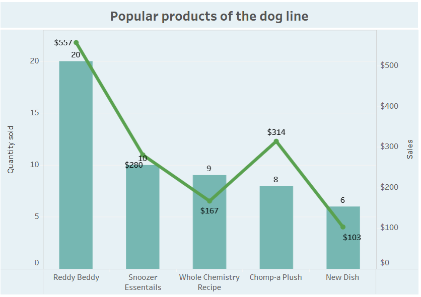

# Introduction
Let me introduce you to Inu+Neko, a dog and cat care company. Focusing on the company's sales data, this project investigates the sales of products over the past year, the most popular products, products purchased on a regular basis, and regular customers.

SQL queries? Check them out here: [project_inu_neko folder](/project_inu_neko/)

# Background
Inu+Neko is a company that sells organic dog and cat food, pet toys, and grooming services. Carlos, the owner of Inu+Neko, is looking to expand his customer base. Carlos has an idea for a new product that he wants to launch - a food subscription for cats and dogs. He realizes that many of his customers come back regularly, so he believes that a subscription can add some convenience to their lives. It's a good way for Carlos to keep his customers loyal. He wants to have 500 subscribers next year. Carlos wants to make sure he is providing the best product possible. He asked analyst Kira a question: What 10 products should be offered as part of the subscription? Carlos can't offer all of his products because it would be challenging for him to keep all of the products in stock from the start of the product launch. Therefore, he suggests choosing 5 products for cats and 5 products for dogs. Based on Carlos's question, analyst Kira defined the goal of the analysis: to select the products that should be offered in the subscription to get 500 subscribers in the first year. 

For the analysis, the dataset [Inu_Neko_Sales.csv](Inu_Neko_Sales.csv) from Carlos about the sales of products sold by Inu+Neko was received. 

### The questions that the analyst Kira wanted to answer with her SQL queries were as follows:

1. What were the sales of goods over the past year?
2. What were the most popular products over the past year?
3. Who are the regular customers?
4. Analysis of products for cats.
5. Analysis of products for dogs.
6. Which products have the highest repeat purchase rate?

# Tools used for analysis
Kira used a few key tools to take a deep dive into Inu+Neko's sales:

- **Google Sheets:** The tool of choice for research and data cleaning. 
- **SQL:** The basis of Kira's analysis, allowing her to query the database and find important data.
- **PostgreSQL:** The database management system of choice, ideal for processing sales data.
- **Visual Studio Code:** The main tool for managing databases and executing SQL queries.
- **Git and GitHub:** Required for version control and sharing SQL scripts and analysis, enabling collaboration, and project tracking.
- **Tableau:** Building visualizations for more visual answers to the questions of the company owner.

# The Analysis
At the beginning of the analysis, the Inu_Neko_Sales.csv dataset contained 11 columns and 301 rows. When Kira examined the data, she found a lot of missing values in the Size column - the size of the package did not carry important information, so she removed it. Several records did not have a Customer_id value - it was not known whether this customer returned regularly or one-time. For analysis purposes, records without Customer_id are not valuable, so she deleted 12 rows. Kira also discovered that some product names were missing, but there was a SKU (unique product identifier) value next to them that could be used to determine the product name and fill in the missing values. Next, she found that some Product_Category values (bedding, food, toy, treat) were missing. But by the name of the products, she determined which category they belong to and filled in the missing values. She also identified one missing Product_Line value by the product name. Now the dataset is clean and ready for analysis, with 10 columns and 289 rows.

Each inquiry for this project was intended to explore certain aspects of the company's sales. Here's how Kira approached each question:

### 1. What were the sales of goods over the past year?
To determine the product sales, she filtered the sales by year, product line, category, product name, and summarized the values, focusing on 2021. This query highlights the highest product sales amounts for 2021.

```sql
SELECT 
    EXTRACT(YEAR from date) as year,
    product_line,
    product_category,
    product_name,
    sum(sales) as total_sales
FROM inu_neko_sales
WHERE EXTRACT(YEAR from date) = 2021
group by year, product_line, product_category, product_name
ORDER BY year DESC, total_sales DESC
;
```


Here's a breakdown of sales by product in 2021:
- **Total sales:** The company's 20 product names generated revenues ranging from $38.17 to $556.78, indicating varying demand for the products.
- **Product diversity:** Products such as Reddy Beddy, Feline Fix Mix, Yum Fish-Dish, and Chomp-a Plush generated the most revenue for the company, demonstrating the highest demand.
- **Product category diversity:** There are four product categories: Bedding, Treat, Foot and Toy.
- **Product lines:** The products are divided into two lines for cats and dogs.


*A histogram visualizing sales by product in 2021, created using Tableau*. 

### 2. What were the most popular products over the past year?
To determine the most popular products, I filtered the data by year, found the total number of units sold and the total number of customers who bought it for each product. I sorted them by the number of units sold and then by the number of customers. This query emphasizes the products with the highest number of units sold.
```sql
SELECT 
    product_name, 
    product_category,
    SUM(quantity) as total_quantity_sold,
    SUM(sales) as total_sales,
    COUNT(DISTINCT customer_id) as customers
FROM inu_neko_sales
WHERE EXTRACT(YEAR from date) = 2021
GROUP BY product_name, product_category
ORDER BY total_quantity_sold DESC
LIMIT 10
;
```


Here's a breakdown of the most popular products in 2021:
- **Total quantity sold:** The 10 products that were sold in the largest quantity were in the range of 6 to 10 units.
- **Customers:** The number of customers who bought these products in the range from 2 to 10 people.


*A histogram visualizing the most popular products in 2021, built using Tableau*. 

### 3. Who are the regular customers?
To identify regular customers, I filtered the data by the number of purchases per customer of 3 or more. I calculated the number of purchases, the total amount spent, and the average check.
```sql
SELECT 
    customer_id,
    COUNT(DISTINCT order_number) as repeat_purchases,
    SUM(sales) as total_sales,
    ROUND(AVG(sales), 2) as avg_order_value
FROM inu_neko_sales
--WHERE EXTRACT(YEAR from date) = 2021
GROUP BY customer_id
HAVING COUNT(DISTINCT order_number) >= 3
ORDER BY COUNT(DISTINCT order_number) DESC
LIMIT 100
;
```


Here are the regular buyers in 2021:
- **Repeat purchases:** There were only 2 repeat customers, based on the fact that they made 3 or more purchases. Other customers made only 1 or 2 purchases.
- **Average order value:** The amount of the average purchase receipt of repeat customers.

### 4. Analysis of products for cats.
To identify cat food products, I filtered the data by year and product line, calculated the number of units sold, the revenue generated, and the number of customers who bought the product. This query highlights the most popular products from the cat line.
```sql
SELECT 
    product_name,
    product_line,
    SUM(quantity) as cat_product_quantity,
    SUM(sales) as cat_product_sales,
    COUNT(DISTINCT customer_id) as cat_unique_customers
FROM inu_neko_sales
WHERE EXTRACT(YEAR from date) = 2021
    AND product_line = 'cat'
GROUP BY product_name, product_line
ORDER BY cat_product_quantity DESC
LIMIT 10
;
```


Here is the analysis of the products from the cat line in 2021:
- **Cat Product Quantity:** The number of units of cat products sold. Yum Fish-Dish has sold the most units.
- **Cat Product Sales:** The amount received from the sale of each product.
- **Cat Unique Customers:** The number of customers who bought each product.


*A histogram visualizing the most popular products from the cat line in 2021, built using Tableau*. 

### 5. Analysis of products for dogs.
To identify dog products, she filtered the data by year and product line, calculated the number of units sold, the revenue generated, and the number of customers who bought the product. This query highlights the most popular products from the dog line.
```sql
SELECT 
    product_name,
    product_line,
    SUM(quantity) as dog_product_quantity,
    SUM(sales) as dog_product_sales,
    COUNT(DISTINCT customer_id) as dog_unique_customers
FROM inu_neko_sales
WHERE EXTRACT(YEAR from date) = 2021
    AND product_line = 'dog'
GROUP BY product_name, product_line
ORDER BY dog_product_quantity DESC
LIMIT 10
;
```


Here is the analysis of products from the dog line in 2021:
- **Dog Product Quantity:** The number of units of dog products sold. The most sold is 20 units of Reddy Beddy.
- **Dog Product Sales:** The amount received from the sale of each product.
- **Dog Unique Customers:** The number of customers who bought each product.




*A bar chart visualizing the most popular products from the dog line in 2021, created using Tableau*. 

### 6. Which products have the highest repeat purchase rate?
To determine which products were sold most often, she filtered sales by year, counted the number of unique customers, the total number of units sold, and then calculated the average number of products per customer. This SQL query allows you to identify the 10 most popular products with the highest average number per customer, which indirectly indicates the frequency of repeat purchases. These 10 products have the highest subscription potential. Customers show a consistent interest in these products. It is highly likely that customers will want to buy them on a regular basis.

```sql
SELECT 
    product_name,
    COUNT(DISTINCT customer_id) as total_customers,
    SUM(quantity) as total_quantity,
    ROUND(SUM(quantity) * 1.0 / COUNT(DISTINCT customer_id), 2) as avg_quantity_per_customer
FROM inu_neko_sales
WHERE EXTRACT(YEAR from date) = 2021
GROUP BY product_name
ORDER BY avg_quantity_per_customer DESC
LIMIT 10
;
```


Here is the analysis of products from the dog line in 2021:
- **Total Customers:** The total number of customers who bought the product.
- **Total Quantity:** The total number of units sold.
- **Average Quantity per Customer:** The average number of units sold per customer. The most number of repeat purchases is 3, and the products that sold 3 times are: Kitty Climber, Cat Cave, Whole Chemistry Recipe, Tug-a-Back and New Dish.


*A histogram visualizing the products with the highest frequency of recurrence in 2021, built using Tableau*. 

[Dashboard Tableau](https://public.tableau.com/views/InuNeko_17340776918960/Dashboard1?:language=en-US&:sid=&:redirect=auth&:display_count=n&:origin=viz_share_link)
# Conclusions
Key recommendations for Carlos:
## Criteria for choosing products for subscription:
- High number of sales
- Frequent repeat purchases
- Popularity among regular customers
- Balance between cat and dog products
## Additional factors for analysis:
- Average price of products
- Seasonality of sales
- Margins of products
## Potential steps:
- Conduct a survey among regular customers
- Create a pilot version of the subscription
- Offer flexible subscription terms
- Monitor feedback


Next steps:

- Analyze these products in more detail
- Check their price and profitability
- Evaluate the logistics of delivery

These SQL queries will help Carlos make an informed choice of subscription products that maximize his chances of reaching the goal of 500 subscribers in the first year.
